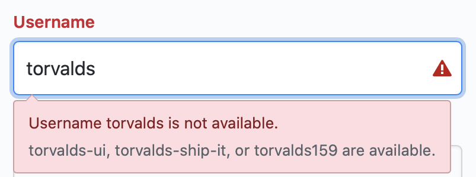
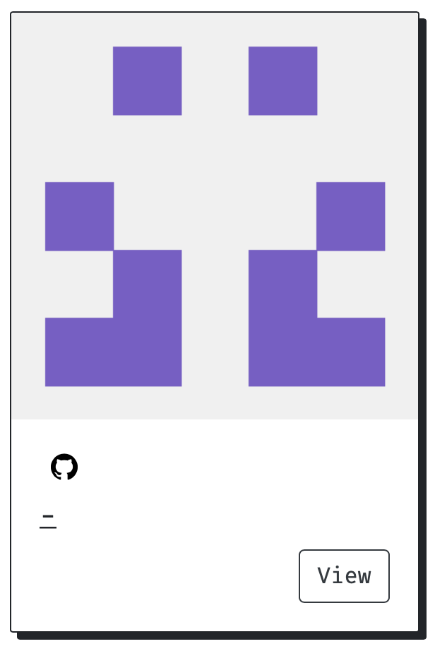
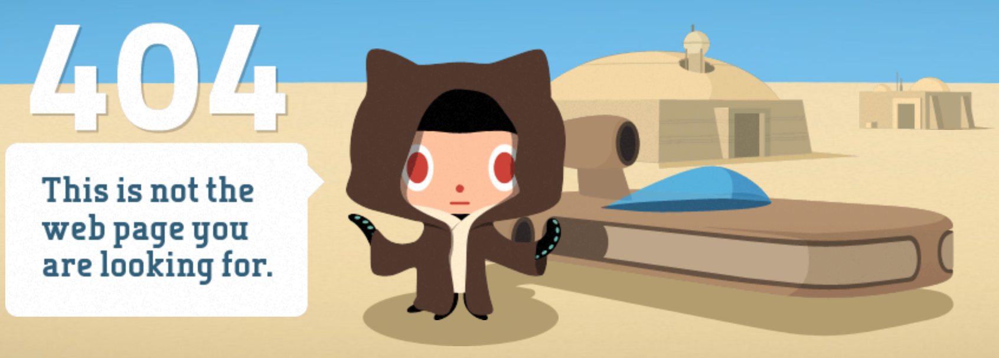
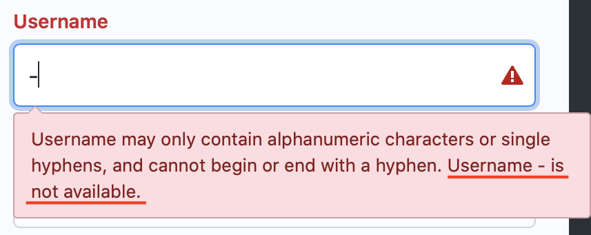
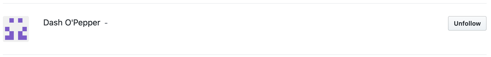
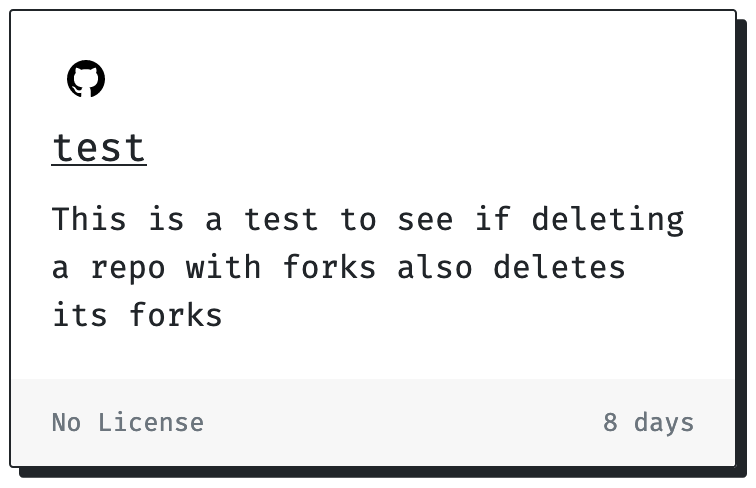
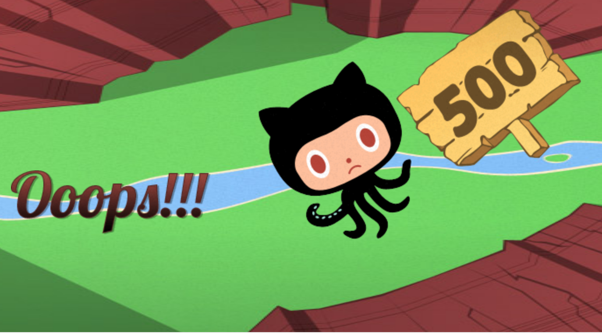

<p align="center">
    
    <i style="color: var(--dark-color-lighter)">random image from unsplash</i>
</p>

This other day I was writing an app to play with React and GitHub's API and ended up finding a specially unusual account

Here's the thing, if you try to sign up for a new account on GitHub your username must meet a certain criteria, to quote their error message:

> _**Username may only contain alphanumeric characters or single hyphens, and cannot begin or end with a hyphen.**_

And if you try to register with an username that already exists you get this:

<p align="center">
    
    <i style="color: var(--dark-color-lighter)">nice try</i>
</p>

## Okay, so what?

Let's go back to the app I'm making, it leverages GitHub's API to fetch any user's starred repos and displays them in a gallery mode so you can ~~stalk through~~ _browse_ their activity

I was ~~stalking~~ playing around on it with some seed data and ended up seeing this little guy pop up in the UI

<p align="center">
    
</p>

At that moment I was like:

> Wtf? I thought I had the username displaying, what is this -? Let me check the code again, probably a typo ... yep, I do have the username displaying ... wait a minute 🤔

Okay, let's try seeing "-" profile page on GitHub's actual UI <a href="https://github.com/-" target="_blank" rel="noopener noreferrer"><u>https://github.com/-</u></a>:

<p align="center">
    
</p>

At this point I was very confused, how come my app UI shows me that there's this ghost user but GitHub's UI doesn't?

Let's go back to the sign up page and try registering using a "-" too

<p align="center">
    
    <i style="color: var(--dark-color-lighter)">???</i>
</p>

Notice we are getting the combination of both error messages this time, the one for allowed characters **and** the one for username already taken

I was now determined to explore it a bit further using GitHub's REST API, feel free to continue to follow along

## Finding the mysterious account through GitHub's REST API

First, let's do a plain GET on the search endpoint _- if you're on firefox you can open this link directly in the browser to see a nice json output -_, feel free to use postman, curl, anything

The endpoint is `/search/users` and the querystring is `-`, so the end result will look like this:

- <u>https://api.github.com/search/users?q=-</u>

I know right? I got 2 results and was surprised yet again, turns out the second result did not have dashes in their username but had dashes in their email which is probably why it got returned

> _Thinking about this now, as per the [<u>RFC 5322</u>](https://tools.ietf.org/html/rfc5322), the local-part of an email is allowed to have dashes in it, so maybe that's why the search endpoint allows for that odd query string_

This was fun, let's keep going and grab more info around Mr. Dash, let's use another GET endpoint for discovering user information

The endpoint this time is `/users/:username`, so the end result is now:

- <u>https://api.github.com/users/-</u>

Yay, no 404 this time! Looks like we got some further details about Mr. Dash and it turns out the account name is actually Dash O'Pepper (the account owner obviously knows what's up), here's the full JSON output:

```json
{
  "login": "-",
  "id": 75544,
  "node_id": "MDQ6VXNlcjc1NTQ0",
  "avatar_url": "https://avatars2.githubusercontent.com/u/75544?v=4",
  "gravatar_id": "",
  "url": "https://api.github.com/users/-",
  "html_url": "https://github.com/-",
  "followers_url": "https://api.github.com/users/-/followers",
  "following_url": "https://api.github.com/users/-/following{/other_user}",
  "gists_url": "https://api.github.com/users/-/gists{/gist_id}",
  "starred_url": "https://api.github.com/users/-/starred{/owner}{/repo}",
  "subscriptions_url": "https://api.github.com/users/-/subscriptions",
  "organizations_url": "https://api.github.com/users/-/orgs",
  "repos_url": "https://api.github.com/users/-/repos",
  "events_url": "https://api.github.com/users/-/events{/privacy}",
  "received_events_url": "https://api.github.com/users/-/received_events",
  "type": "User",
  "site_admin": false,
  "name": "Dash O'Pepper",
  "company": null,
  "blog": "",
  "location": null,
  "email": null,
  "hireable": null,
  "bio": null,
  "public_repos": 1,
  "public_gists": 0,
  "followers": 13,
  "following": 0,
  "created_at": "2009-04-19T23:52:47Z",
  "updated_at": "2014-04-11T21:48:45Z"
}
```

Wait, what? 13 Followers? Since we can't actually see this account through GitHub's web interface, that must mean 13 other people went the trouble of using GitHub's API to authenticate themselves and follow Dash O'Pepper (plot twist, I'm included in that count)

You can see the list of people that follow Dash O'Pepper here _(might have changed after this article was published)_:

- <u>https://api.github.com/users/-/followers</u>

I know, you also want to be part of this ~~cult~~ select club (at least I wanted), so how do we do that?

## Back to GitHub's API docs:

> Following a user requires the user to be logged in and authenticated with basic auth or OAuth with the <u>user:follow</u> scope.

There's a bit to cover so for the sake of brevity I'll handle that for GitHub's docs this time, just follow what's in here:

- <u>https://help.github.com/en/github/authenticating-to-github/creating-a-personal-access-token-for-the-command-line</u>

Make sure you end up with something like the picture below and that your token has the `user:follow` scope:

<p align="center">
    
</p>

Grab that and you should now be ready to perform authenticated actions on github from the command line

<p align="center">
    
</p>

### Ok, cool, how do we follow someone on github through their API now?

This time the endpoint will be `/user/following/:username` and it needs to be a PUT request, let's follow `-`

```bash
curl -X PUT -i -u username:token https://api.github.com/user/following/-
```

You can confirm by going to the following tab on your github profile page _(although bonus point to you if you use the API to confirm that)_

<p align="center">
    
    <i style="color: var(--dark-color-lighter)">Dash O'Pepper in my following list</i>
</p>

## A word of caution

> ⚠️ **! Do not attempt the next steps if you want to keep your GitHub's stars tab functional**

Looks like Dash O'Pepper also has a single repo called `test` with the following description:

<p align="center">
    
    <i style="color: var(--dark-color-lighter)">-'s test repo details from my app</i>
</p>

Seeing that made me wonder if that could possibly be some GitHub's staff account or some QA account that they use for internal stuff

Seems like the repo was modified pretty recently too, that made me curious so I tried cloning that repo, but this is what I get

```
Cloning into 'test'...
Username for 'https://github.com': this-fifo
Password for 'https://this-fifo@github.com':
remote: Repository not found.
fatal: repository 'https://github.com/-/test.git/' not found
```

That made me a bit sad but okay, then I tried seeing if I could at least star his repo, which, according to the API you can do by making another PUT request to `/user/starred/:owner/:repo`

```bash
curl -X PUT -i -u username:token https://api.github.com/user/starred/-/test
```

Yay, that worked, that is why I could see details from his repo on my app in the picture from before, let's see now see it on my profile through GitHub's as well and ...

<p align="center">
    
    <span style="color: var(--dark-color-lighter)">(╯°□°)╯︵ ┻━┻</span>
</p>

Looks like I broke my stars tab on github after that, possibly even a bug in their code, but everything else in still works fine and since I plan to use my new app for ~~stalking~~ browsing through users starred collection anyways I'll leave that as is for now

Hope you had fun reading this and if you are Dash O'Pepper thank you for entertaining me for a bit _(seriously tho, who are you? how did you do this?)_

Also, my app is a work in progress but it's open source, feel free to play on it if you want, the code is at <u>https://github.com/this-fifo/stella</u>
